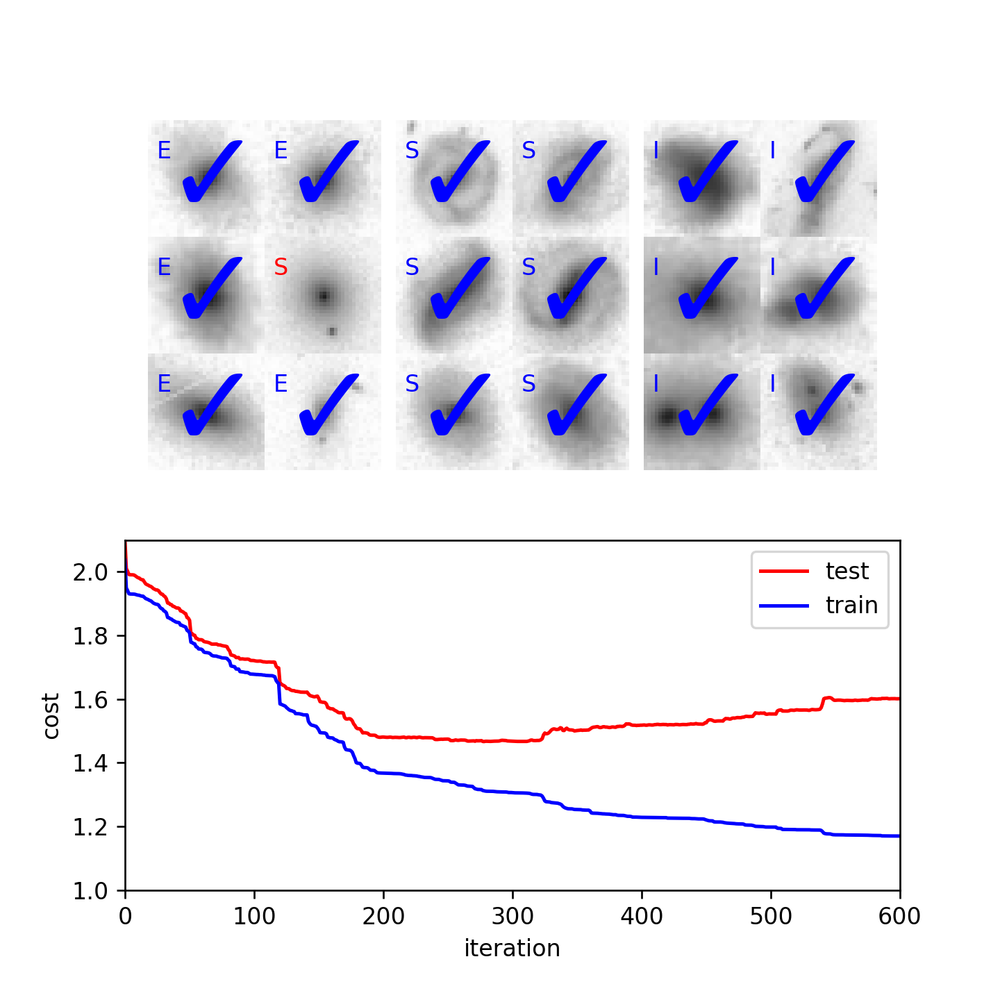

# artificialneuralnetwork-python
Artificial Neural Network for Image Classification

## Create Your Own Artificial Neural Network for Multi-class Classification (With Python)

### Philip Mocz (2023) [@PMocz](https://twitter.com/PMocz)

Create and train your own artificial neural network to classify images of galaxies from SDSS/the Galaxy Zoo project.

Data used in this work is heavily modified and simplified from  the Galaxy Zoo 2 (Willett et al.,2013), MNRAS, 435, 2835.


```
python artificialneuralnetwork.py
```


